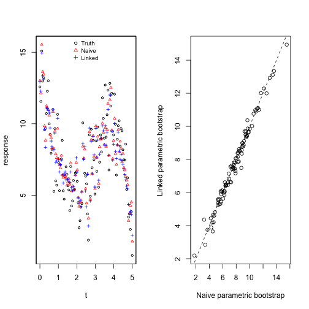
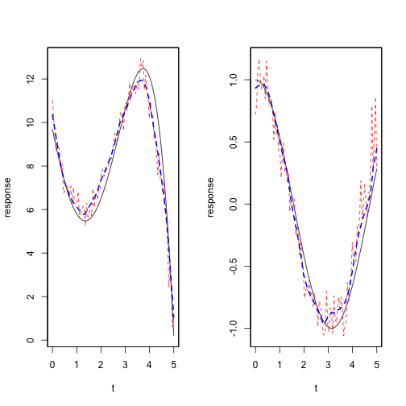

# Introduction


# Local polynomial regression


# Inference

## Parametric bootstrap

### Naive parametric bootstrap
We require a parametric model from which to make parametric bootstrap draws. For local polynomial regression, the model used to make the draws is the one that uses all available covariates. An independent model is generated at each observation location.
\begin{gather*}
\left\{ f(\bm{s})h^{2}n\right\} ^{1/2}\left[\hat{\bm{\beta}}_{(a)}(\bm{s})-\bm{\beta}_{(a)}(\bm{s})-(2\kappa_{0})^{-1}\kappa_{2}h^{2}\left\{ \nabla_{uu}^{2}\bm{\beta}_{(a)}(\bm{s})+\nabla_{vv}^{2}\bm{\beta}_{(a)}(\bm{s})\right\} \right]\\
\xrightarrow{d}N\left(0,\kappa_{0}^{-2}\nu_{0}\sigma^{2}\Psi_{(a)}(\bm{s})^{-1}\right),
\end{gather*}
where $\left\{ \nabla_{uu}^{2}\bm{\beta}_{(a)}(\bm{s})+\nabla_{vv}^{2}\bm{\beta}_{(a)}(\bm{s})\right\} =\left(\nabla_{uu}^{2}\bm{\beta}_{1}(\bm{s})+\nabla_{vv}^{2}\bm{\beta}_{1}(\bm{s}),\dots,\nabla_{uu}^{2}\bm{\beta}_{p_{0}}(\bm{s})+\nabla_{vv}^{2}\bm{\beta}_{p_{0}}(\bm{s})\right)^{T}$.

Denote bootstrap draws from the distribution for $\hat{\bm{\beta}}(\bm{s})$ by $\bm{\beta}^*_k(\bm{s})$ for $k = 1, \dots, B$. Then the corresponding response values are
\begin{align*}
y^*_k(\bm{s}) &= \bm{x}(\bm{s}) \bm{\beta}^*_k(\bm{s}) + \varepsilon(\bm{s}) \\
&\text{for  } i=1, \dots, B
\end{align*}

Now we have the resampled responses at $\bm{s}$: $y^*_1(\bm{s}), \dots, y^*_B(\bm{s})$ from the correct marginal distribution, but the draws at $\bm{s}$ are unconditional on the bootstrap draws at location $\bm{t}$.

In truth, the 

### Linked parametric bootstrap


# Example
The method is illustrated by an example where the data arises from a varying coefficient model with a one-dimensional effect-modifying parameter, $t \in [0,1]$. The data is generated by:
\begin{align*}
y(t) &= \beta_0(t) + x(t)\beta_1(t) + \varepsilon(t)\\
\beta_0(t) &= 1 - 4(t-2) + 0.7(t-1)^2 + t^3 - 0.2t^4 \\
\beta_1(t) &= \cos{t} \\
X &\sim^{iid} N(3,2) \\
\varepsilon &\sim^{iid} N(0,1)
\end{align*}


The response and the coefficients are plotted below:


```r
layout(matrix(1:3, 1, 3))
plot(x=tt, y=y, xlab='t', ylab='y')
plot(x=tt, y=f1(tt), xlab='t', ylab=expression(beta[0]), type='l')
plot(x=tt, y=f2(tt), xlab='t', ylab=expression(beta[1]), type='l')
```

 


The parametric bootstrap is used to simulate the distribution of the estimated coefficient functions. Below, the truth is plotted versus the estimates of $y, \beta_0,$ and $\beta_1$.

\begin{figure}
 
    \caption{The simulated response, and the response as resampled by the naive parametric bootstrap and the linked parametric bootstrap.}
    \label{fig:fitted-responses}
\end{figure}

 

