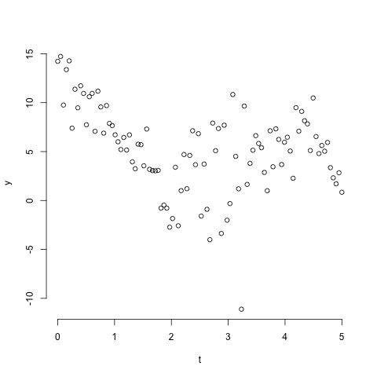
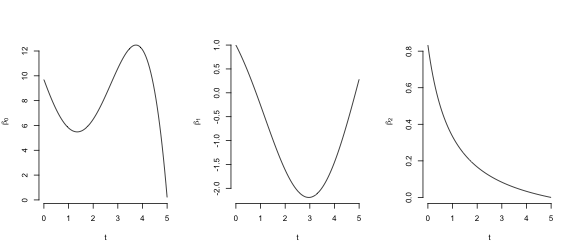
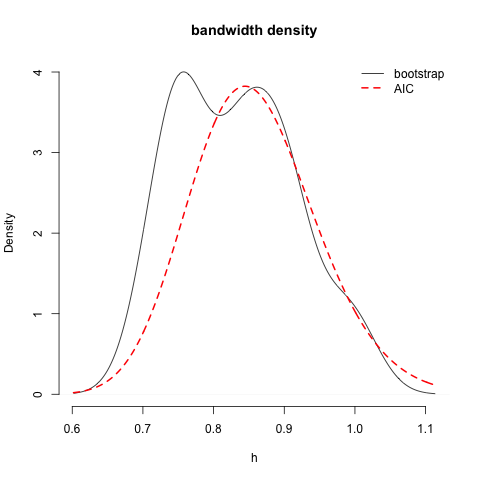
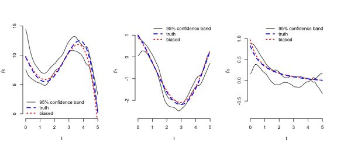

#Introduction

Estimation of a VCR model by LAGR is contingent on the bandwidth parameters, and involves estimation of an adaptive Lasso tuning parameter. Furthermore, the coefficients estimated by LAGR are not smooth because of the variable-selection step. As a result, the distribution of the coefficients is complicated, with a point mass at zero and a continuous distribution when the coefficient is estimated as nonzero. 

#Methods

The coefficient estimates are contingent on the data and the bandwidth, so their sampling distribution is written as

$$ p(\hat{\boldsymbol{\beta}}(s) | y, h). $$

Our inferences about coefficients should be marginal to the bandwidth parameter. That is, we want the distribution

$$ p(\hat{\boldsymbol{\beta}}(s) | y). $$

Getting to the desired distribution requires integrating out the bandwidth parameter:

$$ \int p(\hat{\boldsymbol{\beta}}(s) | y,h) \: p(h|y) \: {\rm d}h. $$

And we carry out the integration via a hybrid bootstrap and empirical Bayes method.

##Empirical Bayes
A fully Bayesian method of inference would require specifying prior distributions on the parameters. We would like to take advantage of Bayesian methods for integrating hierarchical models but to avoid the need to specify a prior distribution of the parameters. Here, we use empirical Bayes methods to average the VCR coefficients over the distribution of the bandwidth parameter.

The bandwidth parameter is chosen to minimize the AIC, which an estimate of the expected density of a new data set generated by the same process as the observed data. That is,

$$ AIC = \hat{E} \{ p(\tilde{y} | \hat{\boldsymbol{\beta}}(y) \} $$

where $\tilde{y}$ is an independent data set following the same distribution as $y$, the observed data. 

The $\hat{h}$ that maximizes the AIC is found by profiling the AIC over the possible range of $h$. At each candidate $h$, the AIC calculation assumes that the parameters $\boldsymbol{\beta}$ are fixed at the MLE, ignoring variability in the coefficient estimates. So in general the profile AIC will underestimate variability in the sampling distribution of $h$. In order to integrate over the distribution $p(h | y)$, then, we simulate the distribution via the bayesian bootstrap.

##Bayesian bootstrap
The Bayesian bootstrap is used to simulate the distributions $p(\hat{\boldsymbol{\beta}}(s) | y, h)$ and $p(h | y).$ To generate each simulation via the bayesian bootstrap, weight vector $W^*_j = (w_{j1}, \dots, w_{jn})$ is drawn from a uniform Dirichlet distribution for each bootstrap $j=1, \dots, B$. Then estimation of $\hat{\boldsymbol{\beta}}^*_j(s)$ proceeds via weighted likelihood using the weight vector.

##Importance resampling
It is possible to estimate the distribution of the bandwidth parameter from the AIC profile. For reasons noted above, this method will tend to underestimate the variability of the bandwidth parameter distribution. However, it is a fine starting point.

The profile AIC approximation to the bandwidth distribution is found by transforming the bandwidth parameter to a scale where it can reasonably be assumed follow a Gaussian distribution. The mean and variance of this distribution are then estimated by fitting a quadratic approximation to the profile AIC, using only the points from the profiling step having AIC within 20 of the minimum.

The benefit of this transformed-normal approximation to the bandwidth distribution is that it can be used to simulate bandwidths for use in estimating the coefficients. Estimating the bandwidth parameter requires profiling the AIC, which involves estimating the coefficients at several bandwidths and is therefore expensive computationally.

Once the bandwidth distribution is estimated, importance resampling is used to reweight the bootstrap draws of the coefficients, where the transformed-normal approximation is treated as the proposal and the kernel density estimate of $p(\hat{h} | y)$ is the target distribution.

##Nonparametric delta method
Standard deviations of the coefficient estimates are computed by the nonparametric delta method (Efron, 2014). The standard deviation of the coefficient estimates at $s$ is:

$$ \tilde{sd}_B = \left[ \sum_{j=1}^n \hat{{\rm cov}}_j^2 \right]^{1/2} $$
where
$$ \hat{{\rm cov}}_j = \sum_{i=i}^B (w_{ij}^* - w_{\cdot j}^*) \{ \boldsymbol{\hat{\beta}}_i^*(s) - \boldsymbol{\hat{\beta}}_{\cdot}^*(s) \} / B $$
with $Y_{\cdot}^* = \sum_{i=1}^B Y_{ij}^* / B$ and $\boldsymbol{\hat{\beta}}_{\cdot}^*(s) = \sum_{i=1}^B \boldsymbol{\hat{\beta}}_i^*(s) / B$.

#Example
A VCR model with one-dimensional location parameter $t$ was used to generate the data in Figure 1. The response was simulated at 100 points spaced uniformly on the interval $[0,5]$. Two covariates, $X_1$ and $X_2$, were simulated according to $X_1 \coprod X_2$ and $X_1, X_2 \sim iid N(3,2)$. The varying intercept $f_0(t)$ and two varying coefficients $f_1(t)$ and $f_2(t)$ are given by

$$ f_0(t) = -0.2t^4 + t^3 + 0.7(t-1)^2 - 4(t-2) + 1 $$
$$ f_1(t) = 0.2t^2 - t + \cos(t) $$
$$ f_2(t) = (t+1)^{-1} - 1/6. $$

The coefficients are pictured in Figure 2, below:

For the analysis of this data, a VCR model was estimated by LAGR using an Epanechnikov kernel with a distance-based bandwidth. This bandwidth is strictly positive and can be arbitrarily large - in fact, if the bandwidth is infinite then we have the standard linear regression model. The starting bandwidth estimator was calculated from the profile AIC. The AIC profile is pictured below:

Since the bandwidth is restricted to the positive numbers, a log-transformation was used to put it on an unrestricted scale. A quadratic approximation to the AIC with bandwidth on the log scale was used to simulate the bandwidth parameter distribution. On the log scale, the mean of this distribution is -0.17 (untransformed, then, the bandwidth is 0.84), and the standard deviation is 0.10.

Now 200 bayesian bootstrap samples were drawn from the distribution of the coefficient functions. This entailed drawing 200 times from the uniform Dirichlet distribution, and drawing 200 times from the approximate distribution of the bandwidth parameter. Then for eaqch of $b=1, \dots, 200$, a sample $\hat{\boldsymbol{\beta}}^*_b(s)$ was drawn from the bootstrap distribution of $\hat{\boldsymbol{\beta}}(s)$ by using LAGR to estimate the coefficients under bandwidth $h^*_b$ and with observation weights $W^*_b$.

The bandwidth distribution estimated from the profile AIC is compared to that produced by kernel density estimation on the simulated bandwidths in Figure 3. The distributions are quite similar and since the bootstrap density is based on only 20 draws, it is possible that these are actually the same distribution.

The 95% confidence bands are plotted in Figure 4, along with the true coefficient functions and the estimable coefficient functions, which include bias proportional to the curvature of the true coefficient function.

